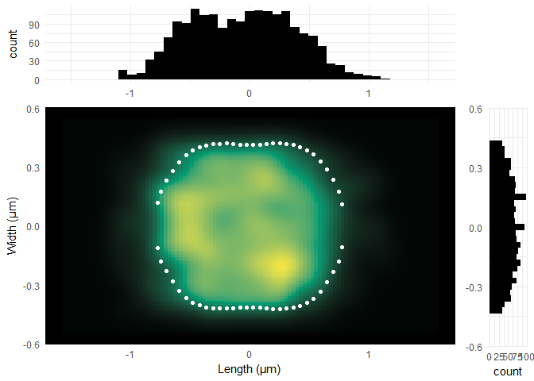
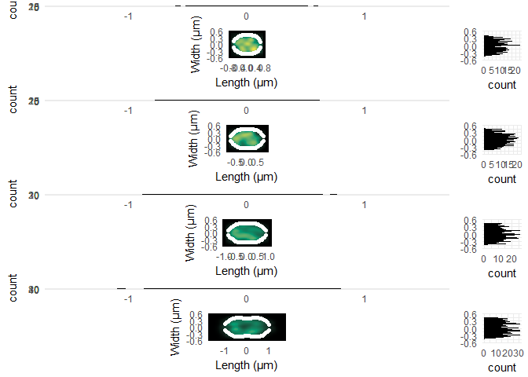

BacTMAP
================

BacTMAP - Bacteria Tool for Microscopy Analysis & Plotting
----------------------------------------------------------

This R package is developed for easy processing, analysis & plotting of segmentation & fluorescence data from multiple popular bacterial (phase-contrast) segmentation tools, like Oufti, MicrobeJ & Morphometrics. The data can be combined with the raw data or spot detection data from other programs.

Importing data
--------------

All importing functions start with **extr.**. See help(bactMAP::extr.all) in the package documentation for a full overview of all import functions.

For example, use **extr.Oufti(rawdatafile, pixels2um)** to load segmentation & spot detection data generated with Oufti, where *rawdatafile* is the location of the .MAT file containing the Oufti output, and *pixels2um* is the conversion factor from the pixels in the data to actual micrometers. This can differ per lab, dependent on the objective and the camera used, therefore you can add your own conversion factor using **addPixels2um()**:

``` r
#Add your own pixels to um conversion factor:
addPixels2um(pixels2um=0.0499538, pixelName="MyPixelConversion")
```

    ## [1] "Currently loaded magnification converters:"
    ## $`100x_LeicaVeening`
    ## [1] 0.0499538
    ## 
    ## $`100x_DVMolgen`
    ## [1] 0.06455
    ## 
    ## $No_PixelCorrection
    ## [1] 1
    ## 
    ## $MyPixelConversion
    ## [1] 0.0499538

``` r
#Load data into R
oufti_example <- system.file("extdata", "oufti_sp_gfpsmc.MAT", package = "bactMAP")
oufti_data <- extr.Oufti(oufti_example, "MyPixelConversion")
```

    ## [1] "Extracting original data from the matlab file... This step may take a while."
    ## [1] "Finished extracting."
    ## [1] "Taking the x/y coordinates of the mesh outlines of each cell... This step may also take a while."
    ## [1] "Converting mesh file into standard BactMAP format..."
    ## [1] 1
    ## [1] 2
    ## [1] 4
    ## [1] 5
    ## [1] 6
    ## [1] 7
    ## [1] "Taking the spot coordinates and information per cell..."
    ## [1] "Adding cell dimensions (length/width) to spot information..."
    ## [1] "Finished Oufti Extraction. Data list includes:"
    ##                         Length Class      Mode   
    ## cellList                14     data.frame list   
    ## mesh                    10     data.frame list   
    ## spotframe                9     data.frame list   
    ## spots_relative_pixel2um  1     -none-     numeric
    ## spots_relative          20     data.frame list

Plotting data
-------------

This dataset contains the outlines of Streptococcus pneumoniae D39 cells and the spot localizations of the structural maintenance of chromosomes (SMC) complex linked to a superfolder-GFP (dataset from van Raaphorst, Kjos & Veening, PNAS, 2017). To get a quick overview of the localization, you can automatically plot the data in different ways.

``` r
#Plot data for quick overview

oufti_plots <- createPlotlist(REP = oufti_data$spots_relative, inp = 4, MESH = oufti_data$mesh, mag="MyPixelConversion")
```

    ## [1] "Turning the cells... this may take a while."
    ## [1] "Turning meshes for frame 1"
    ## [1] "Turning meshes for frame 2"
    ## [1] "Turning meshes for frame 4"
    ## [1] "Turning meshes for frame 5"
    ## [1] "Turning meshes for frame 6"
    ## [1] "Turning meshes for frame 7"
    ## [1] "Finished turning the cells"
    ## [1] "Calculating mean cell outlines.."
    ## [1] "Finished calculating mean cell outlines"
    ## [1] "Done plotting."

``` r
print(summary(oufti_plots))
```

    ##            Length Class      Mode
    ## lengthplot  9     gg         list
    ## widthplot   9     gg         list
    ## qplots      4     -none-     list
    ## plottotal   4     gtable     list
    ## histograms  4     -none-     list
    ## spotdata   23     data.frame list
    ## meshdata   15     data.frame list

Output
------

The output is a list of different plots which are useful for exploring the data. Let's have a look at them in more detail:

Length/Width Kymographs
=======================

Here the cells are ordered by cell length, and the spot localization (density plot) and cell poles (white lines) are plotted. This gives an indication of the localization over the cell cycle when there is no time resolution (!note that time and cell length are often no direct proxys of each other, so interpret with caution!). 

The average cell - totalplot
============================

Here, the average cell shape (white dots) & spot localization is plotted. Side graphs show histograms of length/width spot localization. 

Localization per group - qplots & histograms
============================================

Here, the cells are divided in groups (the amount is indicated by variable *inp* in the function **createPlotlist()**). By default, they are divided by cell length. This can give more insight in the distinct localization or shape of subgroups of cells. 
