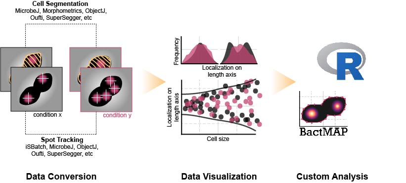
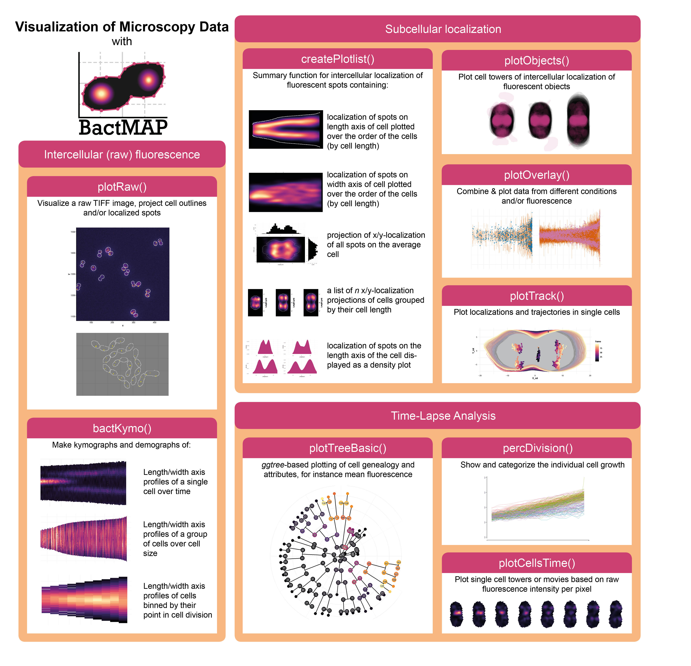

```{r setup, include = FALSE}
knitr::opts_chunk$set(
  collapse = TRUE,
  comment = "#>"
)
```

Welcome to BactMAP! This package is made to make it easier for microbiologists to combine and analyse segmentation & fluorescence data derived from custom software like Oufti, Morphometrics, MicrobeJ or Supersegger. There are standard functions for importing several popular programs, but also options for importing CSVs or Matlab files with a specific structure. If your favorite segmentation or spot detection program is missing, let me know by opening an issue/request on [this page](www.github.com/vrrenske/bactmap/issues).

BactMAP's functionality can basically be ordered in three groups: data import, data visualization & custum analysis. uses ggplot to make visual summaries of the segmentation & fluorescence data, show the cell genealogy, plot protein trajectories in the cell and many other things. This can give you a quick overview of your data to make a decision on further analysis and custom visualization.

This manual contains information each function and a set of vignettes with tutorials to get you started. An online, up-to-date version can also be found on the [bactMAP wiki](www.github.com/vrrenske/bactmap/wiki). 

{width=100%}

## Data Import

### Data from segmentation programs

Depending on the input program and the type of analysis done, the output of the extr_-functions is a list of datasets. The programs, what detection features are imported into bactMAP and the functions to import the data are listed below:

program                       | bactMAP can import:                                                                        | function:                                                      |                     
----------------------------- | ---------------------------------------------------------------------------- | ------------------------------------------------------------------ 
[Oufti](www.oufti.org)        | cell meshes; spots; objects; genealogy| [extr_Oufti()](https://github.com/vrrenske/BactMAP/wiki/extr_Oufti) |
[SuperSegger](https://github.com/wiggins-lab/SuperSegger/wiki) | cell meshes; spots; genealogy | [extr_SuperSeggerClist and extr_SuperSeggerCells](https://github.com/vrrenske/BactMAP/wiki/extr_SuperSeggerCells-and-extr_SuperSeggerClist) |
[ObjectJ](https://sils.fnwi.uva.nl/bcb/objectj/)         | cell bounding box | [extr_ObjectJ](https://github.com/vrrenske/BactMAP/wiki/extr_ObjectJ)() |
[Morphometrics](https://simtk.org/projects/morphometrics)  | cell meshes; objects | [extr_Morphometrics()](https://github.com/vrrenske/BactMAP/wiki/extr_Morphometrics) |
[MicrobeJ](www.microbej.org)  | cell meshes; spots; objects | [extr_MicrobeJ()](https://github.com/vrrenske/BactMAP/wiki/extr_MicrobeJ) |
Custom import from other program | cell meshes; spots; objects | [extr_Meshes()](https://github.com/vrrenske/BactMAP/wiki/extr_Meshes), [extr_Spots()](https://github.com/vrrenske/BactMAP/wiki/extr_Spots) and [extr_Objects()](https://github.com/vrrenske/BactMAP/wiki/extr_Objects) |


### Data from spot detection

Now, only the peak fitter and tracker output data from ISBatch are standardly importable in BactMAP. Other spot tracking output can be imported from .CSV or .TXT using *extr_Spots**.

program                                             | function:
--------------------------------------------------- | -----------------------------------------------------------------------
[ISBatch](http://singlemolecule.github.io/iSBatch/) | [extr_ISBatch()](https://github.com/vrrenske/BactMAP/wiki/extr_ISBatch)
custom import from other program                    | [extr_Spots()](https://github.com/vrrenske/BactMAP/wiki/extr_Spots)


### TIFF data

Uploading the raw tiff stacks can be useful for making kymographs or projections without doing spot or object detection first, or to check your segmentation/detection visually.

data type | function:
--------- | --------------
greyscale, single channel TIFF/TIF image or image stack | [extr_OriginalStack]()

## Data Visualization

In short, the included data visualization functions of BactMAP can be grouped in 3 categories: functions visualizing the fluorescence intensity values directly from uploaded microscopy images, functions for the visualization of subcellular localizations and functions specifically designed to visualize timelapse movies. Below you see an overview of all plotting functions. 

{width=100%}

### Plot the (raw) fluorescence

When using multiple programs to detect cell outlines or internal fluorescence, or when you want to compare the performance of different programs & algorithm, plotting them all next to each other can be very helpful. For this, you can use [plotRaw()](plotRaw{bactMAP}) to do exactly that. 

When you want to have an overview of the localization of your fluorescent protein over time in one cell, [bactKymo()](bactKymo{bactMAP}) can do this for you. Apart from that, it is possible to plot the internal fluorescence in a group of cells ordered by cell length (demographs), or to bin cells of time-lapses by their division state.

### Plot subcellular localization & compare conditions/channels

Most bactMAP plotting functions are made to visualize fluorescence localization (spots or objects) detected with segmentation or detection software inside the cell. The most general function, made for plotting the localization of fluorescent spots inside the cell, is [createPlotlist()](createPlotlist{bactMAP}). A similar function to this is [plotObjects](plotObjects{bactKymo}), which does the same for intercellular objects as filaments. Then, [plotOverlay()]() can be used to plot datasets with multiple conditions and/or fluorescent channels.

Finally, [plotTracks()]() is a function to plot the localization of fluorescent spots in cells over time.

### Time lapse analysis

For time-lapses, there is the possibility to 1. plot the cell genealogy combined with the internal fluorescence using [plotTreeBasic()](), 2. group the cells by their growth speed using [percDivision()]() and make single-cell movies using [plotCellsTime()]().

## Custom Analysis

Finally, after using bactMAP's import & plotting functions you might want to do your specific own analysis; like statistical tests, measurements between localizations, etc. In the [tutorial vignettes]() below you can find some examples of custom analysis you can do when all your data is in one place, but this is by no means limited to that.

## Utilities

### Saving data

To save plots, use *ggsave* from the ggplot2 package:

```{r, eval=FALSE}
ggsave(myPlot, filename="myPlot.PDF")
```

To save R dataframes, use *save*:

```{r, eval=FALSE}
save(myDataFrame, file="myDataFrame.Rda")
```

### Color Palettes

Allmost all of BactMAP's plotting functions use the [viridis color scale](https://cran.r-project.org/web/packages/viridis/vignettes/intro-to-viridis.html) for heatmaps. In addition, the `createPlotlist()` function also recognizes a set of palettes inspired by the [CUD colorblind-friendly palettes](http://jfly.iam.u-tokyo.ac.jp/color/). How to view these palettes or add one palette manually is shown below. For discrete color scales, it is often possible to define your own colors in BactMAP's plotting functions. 

#### Changing the color scale of BactMAP plots
In BactMAPs plotting functions, you can define the color or the color palette inside the plotting function. So a way to change the color of you plot is to re-make your plot with the color or color palette defined inside the function. Check the documentation on the wiki or further in this document for each function's color options!

However, sometimes it might be easier to change the color of your plot after you made the plot. This is also possible using the ggplot2 commands, for instance:

```{r, eval=FALSE}
#for discrete scales:
myPlot_changedColors <- myPlot + scale_fill_brewer("Set1")

#for heatmap scales:
myHeatmap_changedColors <- myHeatmap + scale_fill_viridis("Magma")
```

There are many scales and options within ggplot2. Check options for heatmaps [here](https://ggplot2.tidyverse.org/reference/scale_gradient.html) and more general information about using colors in ggplot2 [here.](http://www.cookbook-r.com/Graphs/Colors_(ggplot2)/)

#### Choosing discrete color scales

The CUD colorblind-friendly palette is saved in bactMAP. To get the hex codes of the CUD color palette, type the following command:

```{r, eval=FALSE}
colorsCUD()
```
For more information and vast choice of good color palettes for plots,
check <http://colorbrewer2.org>

Or if you want to make your own palette, try I want Hue: <http://tools.medialab.sciences-po.fr/iwanthue/>

Finally, for a comprehensive list of R color names, check
<http://www.stat.columbia.edu/~tzheng/files/Rcolor.pdf>

#### Choosing heatmap color scales

BactMAPs functions use the colorblind-friendly viridis palettes as a standard. However, for the cell projection heatmaps in createPlotlist() a few more palettes inspired by the CUD palette are added. Below you can see examples of how to use these functions - check the full documentation of the palette functions further in this manual or on the wiki for more information.

If you want to make your own continuous color scales, try http://gka.github.io/palettes .

#### Modify and view createPlotlist() palettes 
 
```{r, eval=FALSE}
##Check the color palettes 
showCurrentPalettes()

##Pick three colors you like and put them in a list - in the order of lowest value - midpoint - highest value
listofcolors <- list("orangered", "darkseagreen", "burlywood1")

##Add to the color palettes for createPlotlist()
addPalette(listofcolors, "MyBeautifulPalette")
```

### Pixel-micron conversion

To convert pixels to micron, you can save your conversion factor in bactMAP during your R session so you don't have to type it more than once. To do so, use `addPixels2um`:

```{r,eval=FALSE}
## To check the currently loaded pixel conversion factors:
getPixels2um()

## To add your pixel conversion factor to bactMAP:
addPixels2um("MyPixel2um", 0.543)
```

### Combining multiple datasets

For now, bactMAP doesn't include a standard function for batch-uploading and combining data (though it's certainly on the to-do list!). However, after you uploaded & converted the data you want, you can use `combineDataframes` to put all your data together. Here's an example where GFP & RFP data from two different conditions are analyzed in Oufti and uploaded manually. For more explanation on the function, check the documentation further in the document or go to the wiki page.

```{r, eval=FALSE}
GFPdata_WT <- extr.Oufti(file.choose())
RFPdata_WT <- extr.Oufti(file.choose())

RFPdata_mut  <- extr.Oufti(file.choose())
GFPdata_mut  <- extr.Oufti(file.choose())

combined <- combineDataframes(list(GFPdata_WT, RFPdata_WT, RFPdata_mut, GFPdata_mut),
                              listofconditions = list("WT", "WT", "mut", "mut"),
                              listofchannels=list("GFP", "RFP", "RFP", "GFP"))
```


